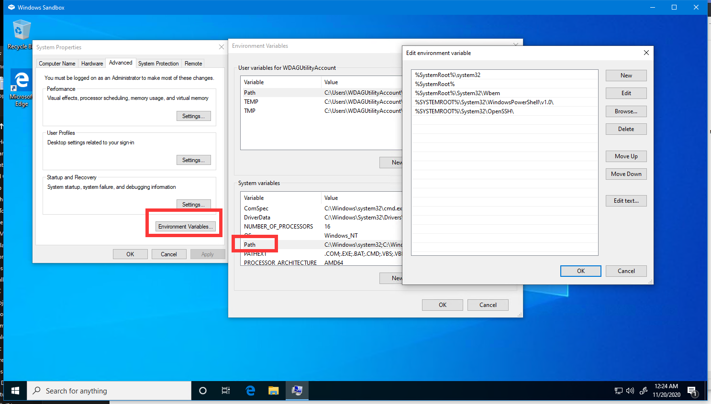
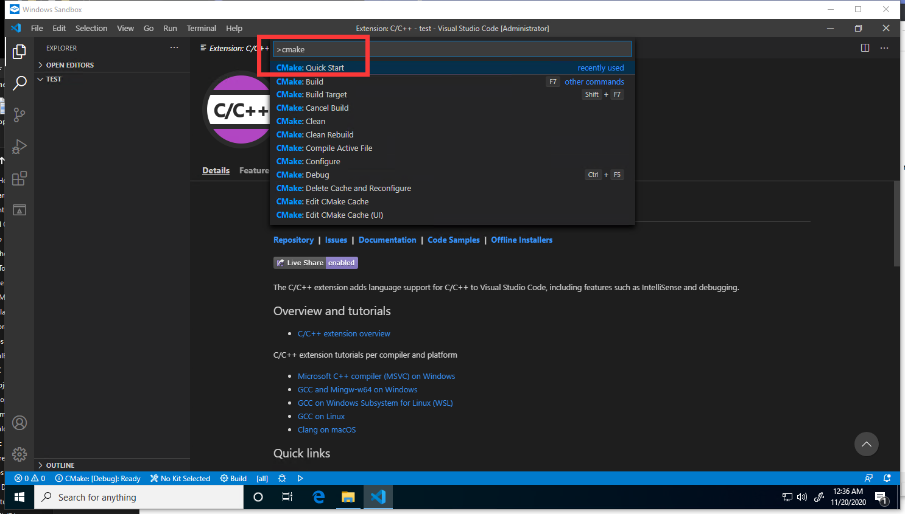
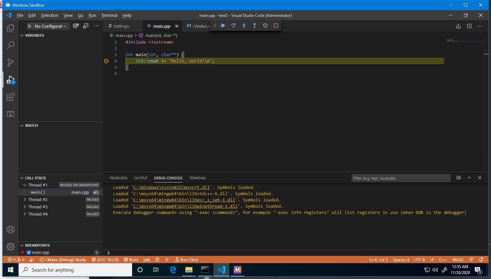

# The definitive guide of setting up C/C++ development environment on Windows
I know a lot of you are having troubles of getting it to work on Windows and complaining a shiton. 

You can just use [Visual Studio](https://visualstudio.microsoft.com/), which is the best and beginner-friendly solution, but for some reason you are just a boomer and don't want to use it. 

Now, you have found the right guide! **Follow the guide and screenshot carefully.** The screenshot are from Windows Sandbox, which is a clean install of Windows 10. **If you followed everything, and can't get it work, open an issue. Let me see how that's even possible!!** 

- [The definitive guide of setting up C/C++ development environment on Windows](#the-definitive-guide-of-setting-up-cc-development-environment-on-windows)
  - [Download these](#download-these)
  - [Install GCC](#install-gcc)
  - [Install CMake](#install-cmake)
  - [Setting up VSCode](#setting-up-vscode)
  - [Setting up CLion](#setting-up-clion)

## Download these
- [cmake](https://cmake.org/download/), choose the ``Windows win64-x64 Installer`` option
- [msys2](https://www.msys2.org/)

## Install GCC
1. Install MSYS2. Just launch the installer and keep clicking "Next"
2. Run MSYS2, type the following command:
```
pacman -Syu
```
It will update the packages info, so you get the latest packages. It will prompt you like this, and you type ``y`` and hit enter.


3. Then it will prompt you `` To complete this update all MSYS2 processes including this terminal will be closed. Confirm to proceed [Y/n]``, type `y` and hit enter, and it will close the window after the update is done.
4. Relaunch MSYS2 from your start menu. Type:
```
pacman -S mingw-w64-x86_64-gcc
```
like this, type `y` and hit enter to install gcc


And then type:
```
pacman -S mingw-w64-x86_64-make
```
And type `y` to also install ``make``.

And then type:
```
pacman -S mingw-w64-x86_64-gdb
```
And type `y` to also install ``gdb``.

5. Now search for ``environment variable`` and open it


6. Click ``Environment Variables``, find ``Path`` in ``System variables``, double click to open the setting.


7. Click ``New`` and copy ``C:\msys64\mingw64\bin`` to the new entry.


8. Click ``OK`` to close all windows. Now you finished installing GCC.

## Install CMake
Launch the insatller, when you see this screen, choose ``Add CMake to the system PATH for all users``

Now you finished installing cmake.

## Setting up VSCode
1. Download [vscode](https://code.visualstudio.com/)
2. Launch the installer, when you see this screen, I **strongly recommend you follow this setting**


3. Run vscode, in the ``extension`` tab, search and install the following 3 extension
- This one is for C++ intellisense/syntax highlighting (or whatever)

- The first one in the list is for syntax highlighting when writing cmake scirpts.
- The second one in the list is for actually running Cmake.


4. Go to settings, search ``generator``. And set ``Cmake:Generator`` to ``MinGW Makefiles``, like this:


5. Create a folder, open it in vscode. Use ``ctrl + shift + p`` to open the command menu, type ``cmake`` and choose ``CMake: Quick Start``, like this:


6. The cmake tool will scan the kits and there will be 2 kits. Select the first one.


7. Type a name for your project, select ``Executable``, CMake tool will automatically generate a helloworld project for you. And you probably don't want to enable ctest for now, so delete everything excpet the following 3 lines:

Rememeber to click ``Allow`` when cmake want to configure the intellisense.

8. And now you can run it and debug it, and have everything working (syntax highlighting, auto complete, header files...).

 

## Setting up CLion
1. Download [clion](https://www.jetbrains.com/clion/download/#section=windows)
2. Launch the installer, keep clicking "Next". When you see the following screen, I strongly recommend you to select ``Add "Open Folder as Project"``.


3. Run clion, set up the appearance as you like, login your account or free trial.
4. After those, it will prompt this window for setting up compilers, it should be all correct and no need to change.


5. Create a new C++ executable or C executable on the left


6. And everything should be working.


