# The definitive guide of setting up C/C++ development environment on Windows
I know a lot of you are having troubles of getting it to work on Windows and complaining a shiton. I will admit, that most C++ programming books do NOT actually tell you how to set things up. And I think that's hilarious, because how are you supposed to program without a working development environment? Even some books do mention it, they usually target Unix operating systems. So what? Can't Windows users properly program in C++? Of course not!

You can just use [Visual Studio](https://visualstudio.microsoft.com/), which is the best and beginner-friendly solution and has really good documentation from Microsoft, but for some reason you are just a boomer and don't want to use it and you are dumb to set up the alternatives.

Now, you have found the right guide! This guide aims to provide the fullest list of every possible main-stream IDEs/text editors you might want to use and its respective configuration on Windows.

**Follow the guide and screenshot carefully.** The screenshot are from Windows Sandbox, which is a clean install of Windows 10. **If you followed everything, and can't get it work, open an issue. Let me see how that's even possible!!** 

- [The definitive guide of setting up C/C++ development environment on Windows](#the-definitive-guide-of-setting-up-cc-development-environment-on-windows)
  - [Setting up development environment](#setting-up-development-environment)
    - [Download & Install a C++ compiler](#download--install-a-c-compiler)
      - [GCC & Clang](#gcc--clang)
        - [Download & Install MSYS2](#download--install-msys2)
        - [Install GCC](#install-gcc)
        - [Install Clang](#install-clang)
        - [What is MSYS2 and Why?](#what-is-msys2-and-why)
      - [MSVC](#msvc)
    - [Download & Install CMake](#download--install-cmake)
      - [Download CMake](#download-cmake)
      - [Install CMake](#install-cmake)
      - [What is CMake and Why?](#what-is-cmake-and-why)
    - [IDEs](#ides)
      - [Setting up CLion](#setting-up-clion)
      - [Setting up QT creator](#setting-up-qt-creator)
      - [Setting up Cevelop](#setting-up-cevelop)
      - [Setting up Visual Studio](#setting-up-visual-studio)
    - [Text editors](#text-editors)
      - [Setting up VSCode](#setting-up-vscode)
      - [Setting up Vim](#setting-up-vim)
      - [Setting up Sublime](#setting-up-sublime)
      - [Setting up Atom](#setting-up-atom)
    - [Setting up Git](#setting-up-git)
  - [Debugging](#debugging)
    - [Debugging in VSCode](#debugging-in-vscode)
    - [Debugging in CLion](#debugging-in-clion)
    - [Debugging in Visual Studio](#debugging-in-visual-studio)
    - [Debugging in QT](#debugging-in-qt)
    - [Debugging in Cevelop](#debugging-in-cevelop)
  - [Using libraries](#using-libraries)
    - [Setting up vcpkg](#setting-up-vcpkg)
    - [Using a library](#using-a-library)
  - [Unit Testing](#unit-testing)
    - [Google Test](#google-test)
    - [Microsoft Unit Test](#microsoft-unit-test)
  - [Documentation](#documentation)
    - [Setting up doxygen](#setting-up-doxygen)
  - [Setting up a system-wide package manager](#setting-up-a-system-wide-package-manager)
    - [Winget](#winget)
    - [Chocolatey](#chocolatey)
  - [Setting up WSL](#setting-up-wsl)

## Setting up development environment
This section describes the steps to 
1. Download & Install a C++ compiler
2. Download & Install CMake
3. Download & Install an IDE/text editor
4. Create a project in various IDEs/text editors and start writing code

### Download & Install a C++ compiler

#### GCC & Clang
##### Download & Install MSYS2
[Download here](https://www.msys2.org/)

Just launch the installer and keep clicking "Next"

##### Install GCC
1. Run MSYS2, type the following command:
```
pacman -Syu
```
`pacman` is the package manager used by MSYS2. `-S` means "sync". `-y` means "download fresh package databases from the server". `-u` means "upgrade installed packages". 

This command will update the packages info, so you get the latest packages. It will prompt you like this, and you type ``y`` and hit enter.


3. Then it will prompt you `` To complete this update all MSYS2 processes including this terminal will be closed. Confirm to proceed [Y/n]``, type `y` and hit enter, and it will close the window after the update is done.
4. Relaunch MSYS2 from your start menu. Type:
```
pacman -S mingw-w64-x86_64-gcc
```
like this, type `y` and hit enter to install gcc


And then type:
```
pacman -S mingw-w64-x86_64-make
```
And type `y` to also install ``make``.

And then type:
```
pacman -S mingw-w64-x86_64-gdb
```
And type `y` to also install ``gdb``.

5. Now search for ``environment variable`` and open it


6. Click ``Environment Variables``, find ``Path`` in ``System variables``, double click to open the setting.


7. Click ``New`` and copy ``C:\msys64\mingw64\bin`` to the new entry.


8. Click ``OK`` to close all windows. Now you finished installing GCC.

##### Install Clang


##### What is MSYS2 and Why?
> MSYS2 is a collection of tools and libraries providing you with an easy-to-use environment for building, installing and running native Windows software.

But basically, we use its implementation of MingW(Minimalist GNU for Windows), which is a collection of common developing tools seen on GNU/Linux operating systems. 

**And please DO NOT follow [this guide](https://code.visualstudio.com/docs/cpp/config-mingw) on Vscode's official tutorial, because the Mingw-w64 project provides an out-dated GCC toolchain.** 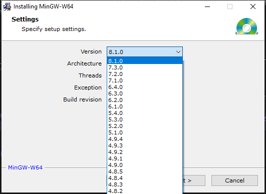

MSYS2 is actively maintained and provides an up-to-date GCC toolchain as well as many others.

#### MSVC
MSVC is Microsoft Visual C++ compiler. And you know what? You do NOT have to install Visual Studio in order to get MSVC. However, it is easier to just install Visual Studio and you can skip to [here](#setting-up-visual-studio) if you like that.
1. Download [MSVC](https://visualstudio.microsoft.com/downloads/#build-tools-for-visual-studio-2019), select `Build Tools for Visual Studio 2019`
2. Launch the installer and select these workflows
  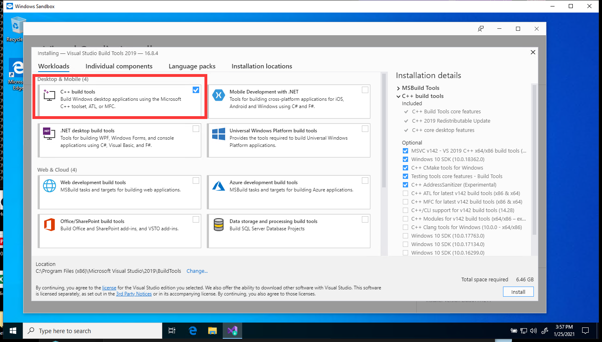


### Download & Install CMake

#### Download CMake
[Download here](https://cmake.org/download/), choose the ``Windows win64-x64 Installer`` option

#### Install CMake
Launch the insatller, when you see this screen, choose ``Add CMake to the system PATH for all users``

Now you finished installing cmake.

#### What is CMake and Why?
CMake is a cross-platform build-system generator, which generates build files (some files dictating how your source files should be built) for your platform. 

For example, on Windows by default, it generate `Visual Studio Solutions` (which is some files dicating how your source files should be built, native to `Visual Studio`) if you have Visual Studio installed. On Linux by default, it generates `Unix Makefiles` (which is some files dictating how your source files should be built, native to `make`).

And because:
> It is a bug if your C/C++ project does NOT provide CMake support.

In reality, some of [the most loved IDEs/text editors](#setting-up-vscode) really just provide good CMake support out-of-the-box. So don't argue that [Meson](https://mesonbuild.com/) is better or some nonsense. To be considered "better", you really have to get good tool chain support.


### IDEs

#### Setting up CLion
1. Download [clion](https://www.jetbrains.com/clion/download/#section=windows)
2. Launch the installer, keep clicking "Next". When you see the following screen, I strongly recommend you to select ``Add "Open Folder as Project"``.


3. Run clion, set up the appearance as you like, login your account or free trial.

4. After those, it will prompt this window for setting up compilers, it should be all correct and no need to change.


5. Create a new C++ executable or C executable on the left


6. And everything should be working.


#### Setting up QT creator


#### Setting up Cevelop
1. Download and install [Java Runtime Environment](https://www.java.com/en/download/manual.jsp), select `Windows Offline (64bit)`
2. Download [Cevelop](https://cevelop.com/download/), select `Windows`.
3. Extract Cevelop and run `cevelop.exe`
   
   If you see this 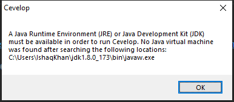, you may incorrectly installed the 32 bit version of Java Runtime Environment! Go back and reinstalled the 64 bit version!
4. 

#### Setting up Visual Studio

1. Download [Visual studio](https://visualstudio.microsoft.com/downloads/). Choose the ``Community`` option.

2. Run the installer, select these workflows
  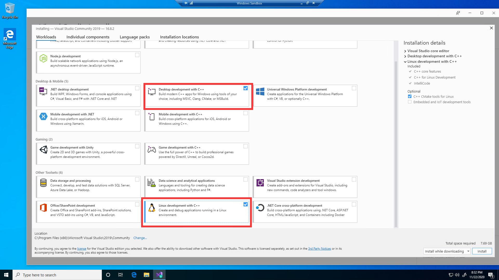

3. After installation, you will need to register a Microsoft Account to continue using Visual Studio. 

After Visual Studio is installed, cmake can detect it as a compiler.
  
  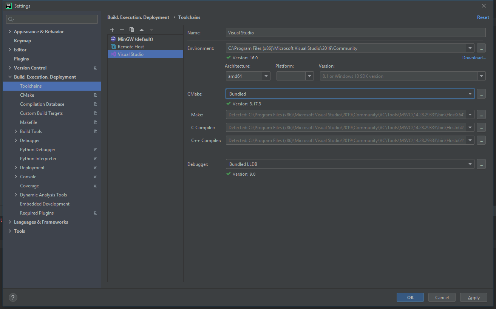

### Text editors

#### Setting up VSCode
1. Download [vscode](https://code.visualstudio.com/)
2. Launch the installer, when you see this screen, I **strongly recommend you follow this setting**


3. Run vscode, in the ``extension`` tab, search and install the following 3 extension
- This one is for C++ intellisense/syntax highlighting (or whatever)

- The first one in the list is for syntax highlighting when writing cmake scirpts.
- The second one in the list is for actually running Cmake.


4. Go to settings, search ``generator``. And set ``Cmake:Generator`` to ``MinGW Makefiles``, like this:


5. Create a folder, open it in vscode. Use ``ctrl + shift + p`` to open the command menu, type ``cmake`` and choose ``CMake: Quick Start``, like this:


6. The cmake tool will scan the kits and there will be 2 kits. Select the first one.


7. Type a name for your project, select ``Executable``, CMake tool will automatically generate a helloworld project for you. And you probably don't want to enable ctest for now, so delete everything excpet the following 3 lines:

Rememeber to click ``Allow`` when cmake want to configure the intellisense.

8. And now you can run it and debug it, and have everything working (syntax highlighting, auto complete, header files...).

 


#### Setting up Vim
1. Download and install Vim [here](https://www.vim.org/download.php#pc). It can be installed by keep clicking "Next" in the installer. (Note: Recommended method to install vim is through a package manager, see [here](#setting-up-a-system-wide-package-manager))


#### Setting up Sublime

#### Setting up Atom


### Setting up Git
Most if not all of the development workflow involves using Git. Also, some [cmake](#install-cmake) functions requires Git to be installed. So you'd better install it [here](https://git-scm.com/download/win).

Git can be installed by keep clicking `Next`.


## Debugging
This section describes how to debug in various IDEs/text editors.
### Debugging in VSCode
### Debugging in CLion
### Debugging in Visual Studio
### Debugging in QT
### Debugging in Cevelop

## Using libraries

### Setting up vcpkg
You **HAVE TO** install Visual Studio on Windows to use `vcpkg`. (Mingw GCC **CAN NOT** be used to build `vcpkg` on Windows at the time being)
After [Visual Studio](#setting-up-msvc) is installed, you can use `vcpkg`.
``vcpkg`` is a C/C++ package manager, which makes using libraries much easier (almost as easy as using ``pip`` in python). Follow the guide [here](https://github.com/microsoft/vcpkg#quick-start-windows).


### Using a library
Of course you want to use [vcpkg](#setting-up-vcpkg), which provides you with an experience of using `pip` with python or `npm` with Javascript. After you install the library in `vcpkg`, you either:
- Use `Visual Studio` without **ANY ADDITIONAL CONFIGURATION**
- Use `cmake` with the instruction provided by `vcpkg` when you install the library.

Below is a complete example of using `vcpkg` to install and use the [boost](https://www.boost.org/) library.

1. Install the library in `vcpkg` with `vcpkg install <Library Name>`, like this:
   ```
   vcpkg install boost:x64-windows
   ```
   Note that `vcpkg` will build 32 bit libraries by default on Windows (although it's 64 bit on Linux by default,~~Microsoft fix it please~~), which is NOT probably what you want, so you want to speficy the architecture by adding `:x64-windows`.
   And you should see the following
   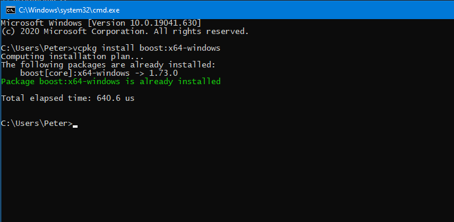

2. Note that on Windows, `vcpkg` builds libraries using `MSVC`, so you should also use `MSVC` in order to link sucessfully. Header-only libraries like `boost` may be used with other compilers like `GCC`.

Afrer the library finishes installing, you can either:

- Use it in Visual Studio without doing any additional configuration
  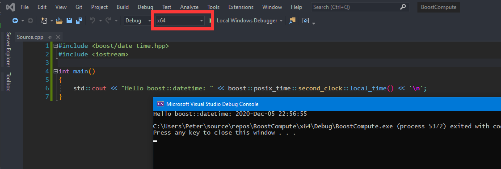
  **Note: Configure the solution achitectural target correctly according to your library. Visual Studio empty project defaults to `x86` but you may installed `x64` library.**

- Or use it in VSCode/CLion with cmake and cmake tool chain file. See the docs [here](https://github.com/microsoft/vcpkg#using-vcpkg-with-cmake)

## Unit Testing

### Google Test
Following setting up `vcpkg`, we can easily install the library necessary for [unit testing](https://en.wikipedia.org/wiki/Unit_testing). Here we demonstrate it with [google test](https://github.com/google/googletest), a famous and widely supported by IDEs/text editors unit testing framework for C++.

### Microsoft Unit Test


## Documentation

### Setting up doxygen
Writing good documentation is also an essential part of development. The most commonly used documentation generator is [doxygen](https://www.doxygen.nl/download.html). Download `the binary distribution for Windows` and then install it. After it is installed, there will be a GUI frontend called `doxywizard`, which looks like this:
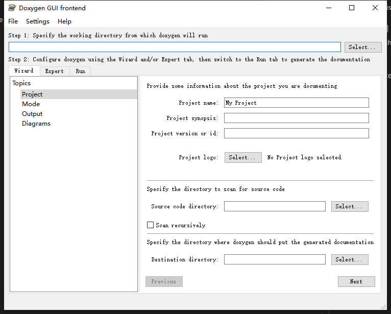
To write good documentation, install these plugins:
- For [VSCode](https://marketplace.visualstudio.com/items?itemName=cschlosser.doxdocgen)
- For [Visual Studio](https://marketplace.visualstudio.com/items?itemName=FinnGegenmantel.doxygenComments)

Learn the syntax for documentation [here](https://www.doxygen.nl/index.html)

After you documment your code, any decent IDEs/text editors should be able to show the documentation, helping you better understand your own code as well as others.
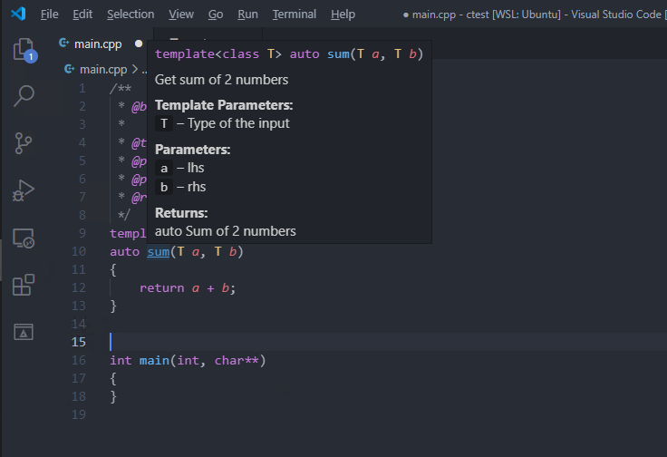
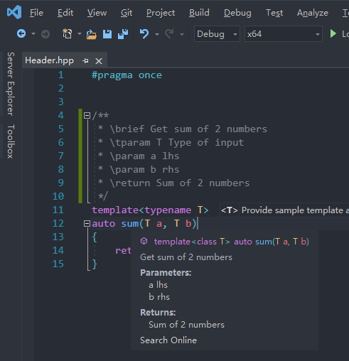

Using doxygen is straight-forward using the GUI, just specify the root directory of your project, configure some settings to your liking, then run it.
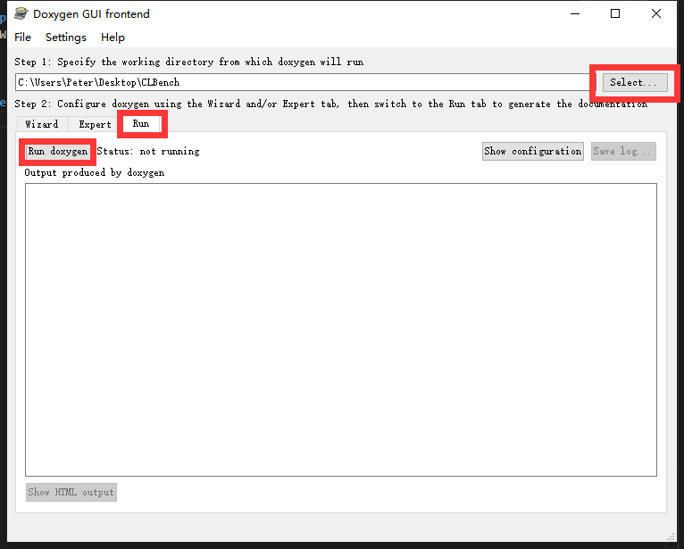

Doxygen generated documentation too ugly? Follow the guide [here](https://devblogs.microsoft.com/cppblog/clear-functional-c-documentation-with-sphinx-breathe-doxygen-cmake/) to use doxygen with sphinx for a more beautiful documentation.

## Setting up a system-wide package manager
You thought Windows does not have an easy-to-use package manager? You might be wrong.

### Winget

### Chocolatey

## Setting up WSL
Setting up WSL is the same as setting up a pure linux environment, therefore it is not discussed here. 
