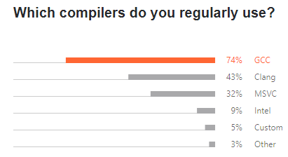
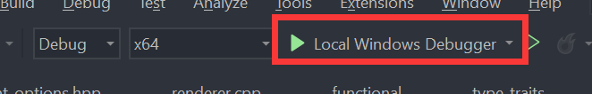
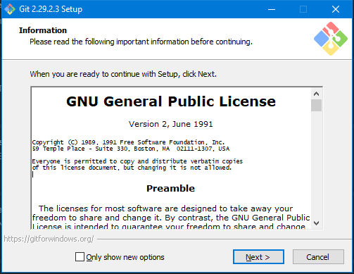

# The definitive guide of setting up C/C++ development environment on Windows
I know a lot of you are having troubles of getting it to work on Windows and complaining a shiton. 
I will admit, that most C++ programming books do NOT actually tell you how to set things up. 
And I think that's hilarious, because how are you supposed to program without a working development environment? 
Although some books do mention it, they usually target Unix operating systems. 

You can just use [Visual Studio](https://visualstudio.microsoft.com/), which is the best and beginner-friendly solution and has really good documentation from Microsoft, but for some reason you are just a boomer and don't want to use it and you are dumb to set up the alternatives.

Now, you have found the right guide! 
This guide aims to provide the fullest list of every possible main-stream IDEs/text editors you might want to use and its respective configuration on Windows.

**Follow the guide and screenshot carefully.** 
The screenshot are from Windows Sandbox, which is a clean install of Windows 10. 
**If you followed everything, and can't get it work, open an issue. Let me see how that's even possible!!** 

A visual summary of this guide:


- [The definitive guide of setting up C/C++ development environment on Windows](#the-definitive-guide-of-setting-up-cc-development-environment-on-windows)
  - [Setting up development environment](#setting-up-development-environment)
    - [Download \& Install a C++ compiler](#download--install-a-c-compiler)
      - [GCC \& Clang](#gcc--clang)
        - [Download \& Install MSYS2](#download--install-msys2)
        - [Install GCC](#install-gcc)
        - [Install Clang](#install-clang)
        - [What is MSYS2 and Why?](#what-is-msys2-and-why)
        - [What's the difference between `/usr/bin` and `/mingw64/bin`](#whats-the-difference-between-usrbin-and-mingw64bin)
      - [MSVC](#msvc)
    - [Download \& Install CMake](#download--install-cmake)
      - [What is CMake and Why?](#what-is-cmake-and-why)
    - [IDEs](#ides)
      - [Setting up CLion](#setting-up-clion)
      - [Setting up QT creator](#setting-up-qt-creator)
      - [Setting up Visual Studio](#setting-up-visual-studio)
        - [Full package](#full-package)
        - [Standalone IDE](#standalone-ide)
    - [Text editors](#text-editors)
      - [Setting up VSCode](#setting-up-vscode)
      - [Setting up Vim](#setting-up-vim)
        - [Using MSYS2](#using-msys2)
        - [Standalone](#standalone)
        - [Optional plugins](#optional-plugins)
  - [Debugging](#debugging)
    - [Debugging in VSCode](#debugging-in-vscode)
    - [Debugging in CLion](#debugging-in-clion)
    - [Debugging in Visual Studio](#debugging-in-visual-studio)
    - [Debugging in QT](#debugging-in-qt)
  - [Using libraries](#using-libraries)
    - [Setting up vcpkg](#setting-up-vcpkg)
    - [Finding and Installing a library](#finding-and-installing-a-library)
    - [Using a library](#using-a-library)
  - [Unit Testing](#unit-testing)
    - [Google Test](#google-test)
      - [Integration with Visual Studio](#integration-with-visual-studio)
      - [Integration with CLion](#integration-with-clion)
      - [Integration with VSCode](#integration-with-vscode)
    - [Microsoft Unit Test](#microsoft-unit-test)
    - [CTest](#ctest)
  - [Documentation](#documentation)
    - [Setting up doxygen](#setting-up-doxygen)
    - [Integrate doxygen with CMake](#integrate-doxygen-with-cmake)
  - [Source control](#source-control)
  - [Setting up a system-wide package manager](#setting-up-a-system-wide-package-manager)
    - [Winget](#winget)
    - [Chocolatey](#chocolatey)
    - [Scoop](#scoop)
  - [Setting up WSL](#setting-up-wsl)
  - [Addtional Tooling](#addtional-tooling)
    - [Resharper](#resharper)
    - [Clang-tidy](#clang-tidy)
      - [Integration with Visual Studio](#integration-with-visual-studio-1)
        - [MSBuild Project](#msbuild-project)
        - [CMake Project](#cmake-project)
      - [Integration with CLion](#integration-with-clion-1)
      - [Integration with VSCode](#integration-with-vscode-1)
    - [ClangFormat](#clangformat)
      - [Integration with Visual Studio](#integration-with-visual-studio-2)
      - [Integration with VSCode](#integration-with-vscode-2)
    - [Incredibuild](#incredibuild)
    - [C/C++ include guard (proud contributor)](#cc-include-guard-proud-contributor)
    - [include-info (proud maker)](#include-info-proud-maker)
    - [VSCode Font switcher (proud contributor)](#vscode-font-switcher-proud-contributor)
---

## Setting up development environment
This section describes the steps to 
1. [Download & Install a C++ compiler](#download--install-a-c-compiler)
2. [Download & Install CMake](#download--install-cmake)
3. [Download & Install an IDE/text editor](#ides)
4. Create a project in various IDEs/text editors and start writing code

### Download & Install a C++ compiler



This guide will cover the installation of `GCC`, `Clang` and `MSVC`.

#### GCC & Clang
##### Download & Install MSYS2
[Download here](https://www.msys2.org/)

Just launch the installer and keep clicking "Next"

##### Install GCC
If you also want to install `clang`, skip this part and go directly to [Install Clang](#install-clang),  because GCC is a dependency of Clang (on MSYS2) and will be automatically installed when you install clang.

1. Run MSYS2, type the following command:
```
pacman -Syu
```
`pacman` is the package manager used by MSYS2. `-S` means "sync". `-y` means "download fresh package databases from the server". `-u` means "upgrade installed packages". 

This command will update the packages info, so you get the latest packages. It will prompt you like this, and you type ``y`` and hit enter.


1. Then it will prompt you `` To complete this update all MSYS2 processes including this terminal will be closed. Confirm to proceed [Y/n]``, type `y` and hit enter, and it will close the window after the update is done.
2. Relaunch MSYS2 from your start menu. Type:
```
pacman -S mingw-w64-x86_64-gcc
```
like this, type `y` and hit enter to install gcc


And then type:
```
pacman -S mingw-w64-x86_64-make
```
And type `y` to also install ``make``.

And then type:
```
pacman -S mingw-w64-x86_64-gdb
```
And type `y` to also install ``gdb``.

5. Now search for ``environment variable`` and open it


6. Click ``Environment Variables``, find ``Path`` in ``System variables``, double click to open the setting.


7. Click ``New`` and copy ``C:\msys64\mingw64\bin`` to the new entry.


8. Click ``OK`` to close all windows. Now you finished installing GCC. Open any shell such as `cmd` and type in `gcc --version` and you shall see the following: 

##### Install Clang
Installing Clang will also automatically install `GCC` (on MSYS2).

1. Run MSYS2, type the following command:
```
pacman -Syu
```
`pacman` is the package manager used by MSYS2. `-S` means "sync". `-y` means "download fresh package databases from the server". `-u` means "upgrade installed packages". 

This command will update the packages info, so you get the latest packages. It will prompt you like this, and you type ``y`` and hit enter.


3. Then it will prompt you `` To complete this update all MSYS2 processes including this terminal will be closed. Confirm to proceed [Y/n]``, type `y` and hit enter, and it will close the window after the update is done.


4. Relaunch MSYS2 from your start menu. Type:
```
pacman -S mingw-w64-x86_64-clang mingw-w64-x86_64-clang-tools-extra
```
like this, type `y` and hit enter to install clang


And then type:
```
pacman -S mingw-w64-x86_64-make
```
And type `y` to also install ``make``.

And then type:
```
pacman -S mingw-w64-x86_64-gdb
```
And type `y` to also install ``gdb``.

5. Now search for ``environment variable`` and open it


6. Click ``Environment Variables``, find ``Path`` in ``System variables``, double click to open the setting.


7. Click ``New`` and copy ``C:\msys64\mingw64\bin`` to the new entry.


8. Click ``OK`` to close all windows. Now you finished installing clang. Open any shell such as `cmd` and type in `clang --version` and you shall see the following: 

(9. Optional): If you want to get clang's implementation of the C++ standard library (ie. the STL), type this command:
    ```
    pacman -S mingw-w64-x86_64-libc++
    ``` 
    When invoking `clang++`, add the flag `-stdlib=libc++`. 
    The header files of `libc++` will be stored at  `C:\msys64\mingw64\include\c++\v1`.


Note: `Clang` and `GCC` is installed to the same directory, eg. under `C:\msys64\mingw64\bin`. Don't be confused by the directory `C:\msys64\clang64`. It is an empty folder.

##### What is MSYS2 and Why?
> MSYS2 is a collection of tools and libraries providing you with an easy-to-use environment for building, installing and running native Windows software.

But basically, we use its implementation of MingW(Minimalist GNU for Windows), which is a collection of common developing tools seen on GNU/Linux operating systems. 
> [!WARNING]
> **Please DO NOT follow [this guide](https://code.visualstudio.com/docs/cpp/config-mingw) on Vscode's official tutorial, because the Mingw-w64 project provides an out-dated GCC toolchain.** 

MSYS2 (in this guide) is actively maintained and provides an up-to-date GCC toolchain as well as many others, is the prefered choice.

##### What's the difference between `/usr/bin` and `/mingw64/bin`
Copied from [this stackoverflow answer](https://stackoverflow.com/questions/49475006/what-is-different-between-gcc-exe-in-msys2-usr-bin-and-gcc-exe-in-msys2-mingww64)
> The GCC compiler in /usr/bin produces executables that use msys-2.0.dll as a runtime dependency. That DLL is basically a fork of Cygwin, and it provides emulation of POSIX commands not normally available on Windows. That environment is mainly for running programs from the Linux world (like bash) which need POSIX commands and cannot be easily ported to a native Windows environment.

> The GCC compilers in /mingw32/bin and /mingw64/bin produce native Windows executables targeting the 32-bit or 64-bit versions of Windows respectively. The 32-bit executables can actually run on 32-bit or 64-bit Windows. These executables are easier to distribute; you generally just copy all the DLLs that they depend on from the /mingw*/bin folder to the same directory as your executable, and then you have something that will run successfully on other computers. Since the main purpose of MSYS2 is to help write native Windows software, you'll find a much wider variety of libraries in the MinGW environments than in the msys-2.0.dll environment.

#### MSVC
MSVC is Microsoft Visual C++ compiler. And you know what? You do NOT have to install Visual Studio in order to get MSVC. However, if you also want Visual Studio, skip to [setting up visual studio](#setting-up-visual-studio) directly.
1. Download [MSVC](https://visualstudio.microsoft.com/downloads/#build-tools-for-visual-studio-2019), select `Build Tools for Visual Studio 2019`
2. Launch the installer and select these workflows
  
3. You have finished installing MSVC. Click `Launch` and type `cl` and you should see this:
  
  
  Do NOT try to add `MSVC` directly to system `PATH` because each compiler toolchain for different architecture has its own version. 

  This command prompt is specific to 64bit Windows architecture and has set some temporary environment variables. You can find it in `Start` -> `Visual Studio 2019` -> `Developer Command Prompt for VS 2019` like this: 


After MSVC is installed, cmake can detect it as a compiler.
  
  

### Download & Install CMake
You can either install CMake by using the official installer or using a package manager like `MSYS2`,
which you used to install `GCC` and `Clang`.
- Using the installer:
  1. [Download here](https://cmake.org/download/), choose the ``Windows win64-x64 Installer`` option

  2. Launch the insatller, when you see this screen, choose ``Add CMake to the system PATH for all users``
  
  Now you finished installing cmake.
- Using `MSYS2`:
  1. Run `MSYS2` and type this command and type `Y` to install
   ```
   pacman -S mingw-w64-x86_64-cmake
   ```
  2. Search for ``environment variable`` and open it -> ``Environment Variables``, find ``Path`` in ``System variables``, double click to open the setting -> click ``New`` and copy ``C:\msys64\usr\bin`` to the new entry.
  

#### What is CMake and Why?
CMake is a cross-platform build-system generator, which generates build files (some files dictating how your source files should be built) for your platform. 

For example, on Windows by default, it generate `Visual Studio Solutions` (which is some files dicating how your source files should be built, native to `Visual Studio`) if you have Visual Studio installed. On Linux by default, it generates `Unix Makefiles` (which is some files dictating how your source files should be built, native to `make`).

And because:
> It is a bug if your C/C++ project does NOT provide CMake support.

In reality, some of [the most loved IDEs/text editors](#setting-up-vscode) really just provide good CMake support out-of-the-box. So don't argue that [Meson](https://mesonbuild.com/) is better or some nonsense. To be considered "better", you really have to get good tool chain support.


### IDEs


This guide will cover setting up `Visual Studio`, `CLion`, `QtCreator`, `Cevelop (based on Eclipse)` and `Eclipse`.

#### Setting up CLion
1. Download [clion](https://www.jetbrains.com/clion/download/#section=windows)
2. Launch the installer, keep clicking "Next". When you see the following screen, I strongly recommend you to select ``Add "Open Folder as Project"``.


1. Run clion, set up the appearance as you like, login your account or free trial.

2. After those, it will prompt this window for setting up compilers, it should be all correct and no need to change.


1. Create a new C++ executable or C executable on the left


1. Clion will auto generate a "Hello world" project and everything should be working.


#### Setting up QT creator
1. Download QT installer [here](https://www.qt.io/download-qt-installer?hsCtaTracking=99d9dd4f-5681-48d2-b096-470725510d34%7C074ddad0-fdef-4e53-8aa8-5e8a876d6ab4)
2. Launch the installer and you will need to either sign in or create a qt account
3. When you see this, click `Custom Install`.
   
4. When you see this, click `Deselect All`, because we only intend to use it as a standalone IDE, aka `Qt Creator`. If you want to do Qt development, select the component to your need.
   
5. After the installation, run `Qt Creator` -> `New File or Project` -> `Non-Qt Project` -> `Plain C++ Application` (this actually doesn't matter, you can always change to a C application in the `CMakeLists.txt` file) -> Choose `CMake` as the build system -> select `all kits` (this will include the different build types in CMake). `Qt Creator` should create a simple "Hello world" program for you, like this:
   
   
   
   
   
6. Click the `Run` button, and it should run
   

Note: If there is error during CMake's configure, go to `Tools` -> `Options` -> `Kits` -> `Desktop(default)`, and make sure the C and C++ compiler is in `C:\msys64\mingw64\bin` instead of `C:\msys64\usr\bin`.


If you installed `Clang` you shall see it in the compiler selection menu:


#### Setting up Visual Studio
You can install Visual Studio as a standalone IDE or as a whole package including compiler, toolchain and windows sdk.
##### Full package
1. Download [Visual studio](https://visualstudio.microsoft.com/downloads/). Choose the ``Community`` option.

2. Run the installer, select these workflows
  

3. After installation, you are prompt to restart your computer. And then you will need to register a Microsoft Account to continue using Visual Studio. 

4. Run Visual Studio, select `Create a new project` -> `Empty Project/Console App`, and select `Place solution and project in the same directory`.
  
  
  
  The only difference between `Empty Project` and `Console App` is the latter will provide you with a "Hello world" program and that's it! All the default include directories and default linked runtime libraries are the same!
  
  - If you choose to create `Empty Project`, right click on the `<Project Name>` -> `Add` -> `New item` -> `C++ source file` -> `Add`, like this: 
  
  
  Then write a simple "Hello world" program and hit `ctrl+f5` to compile and run it, and you shall see this:
  

  - If you choose to create `Console App`, you shall see the already created "Hello world". Hit `ctrl+f5` to compile and run the program and you shall see this: 

##### Standalone IDE
If you install Visual Studio as a standalone IDE without installing MSVC compiler toolchains, you can use it with CMake. If you have installed MSVC compiler toolchain, you can use it with Visual Studio solution just as it's a [full install](#full-package) like above. Here I introduce how to use it with CMake, **without MSVC**.
1. Download [Visual studio](https://visualstudio.microsoft.com/downloads/). Choose the ``Community`` option.

2. Run the installer, select these workflows and deselect all the optionals on the right, like this
  

3. After installation, you need to register a Microsoft Account to continue using Visual Studio.

4. Run Visual Studio, select `Create a new project` -> `CMake Project` -> select `Place Project under the same directory` -> `Create`, like this:
  
  
  
5. Visual Studio will auto generate a "Hello world" project for you, and it can successfully configure the project and compile because CMake can detect the installed `GCC`. However, it will have incorrect include errors.
   
6. To solve this error, click on the configuration menu -> `Manage Configurations` -> click the add button -> select `Mingw64-Debug` -> click on the previous old configuration and click delete button
   
   
   
7. Hit `ctrl+s` to save this configuration, then the include error should go away.
   

Note: If for some reason, Visual Studio doesn't detect the right MingW version, you will still get include errors. You need to edit the `CMakeSettings.json` and correct the MingW version, like this:


### Text editors
#### Setting up VSCode
1. Download [vscode](https://code.visualstudio.com/)
2. Launch the installer, when you see this screen, I **strongly recommend you follow this setting**


3. Run vscode, in the ``extension`` tab, search and install the following extensions
- Install `Microsoft C/C++` extension, It is a Language Server by Microsoft. You can also install llvm's LSP `clangd`. `clangd` will have limitions when using with Visual Studio as CMake's generator. [See the discussion here](https://github.com/HO-COOH/CPPDevOnWindows/pull/3).


- And 2 extensions for cmake. The first one in the list is for syntax highlighting when writing cmake scirpts.
- The second one in the list is for actually running Cmake.


4. Go to settings, search ``generator``. And set ``Cmake:Generator`` to ``MinGW Makefiles``, like this:


1. Create a folder, open it in vscode. Use ``ctrl + shift + p`` to open the command menu, type ``cmake`` and choose ``CMake: Quick Start``, like this:


6. The cmake tool will scan the kits and there will be 2 kits. Select the first one.


7. Type a name for your project, select ``Executable``, CMake tool will automatically generate a helloworld project for you. And you probably don't want to enable ctest for now, so delete everything excpet the following 3 lines:


Rememeber to click ``Allow`` when cmake want to configure the intellisense.

8. And now you can run it and debug it, and have everything working (syntax highlighting, auto complete, header files...).


 


#### Setting up Vim
##### Using MSYS2
1. If you install `vim` in `MSYS2`, your `.vimrc` file should be placed in
   ```
   C:\msys64\home\<UserName>\.vimrc
   ```
2. Create new folders along this path 
   ```
   C:\msys64\home\<UserName>\.vim\autoload
   ``` 
   and then open `powershell` here.
3. Type the following command to install `vim-plug`, a simple vim plugin manager
   ```
   iwr -useb https://raw.githubusercontent.com/junegunn/vim-plug/master/plug.vim |`
       ni plug.vim -Force
   ```

##### Standalone
Download and install Vim [here](https://www.vim.org/download.php#pc). It can be installed by keep clicking "Next" in the installer. (Note: Recommended method to install vim is through a package manager, see [here](#setting-up-a-system-wide-package-manager))

1. Install `vim-plug`
```
iwr -useb https://raw.githubusercontent.com/junegunn/vim-plug/master/plug.vim |`
    ni $HOME/vimfiles/autoload/plug.vim -Force
```

Open `.vimrc`, add these following lines:
```vim
filetype plugin indent on
set tabstop=4 " show existing tab with 4 spaces width
set shiftwidth=4 " when indenting with '>', use 4 spaces width
set expandtab " On pressing tab, insert 4 spaces
syntax on
set nu " Enable line numbers 
set smartindent

call plug#begin('~/.vim/plugged') " List all the plugins to be installed

Plug 'neoclide/coc.nvim'

call plug#end() " End of plugins
```

2. Install `coc-clangd`, the C++ language client extension

    Open whatever C++ file, and type command `:CocCommand clangd.install`

3. Install `clangd`, the actual C++ language server.
  
    Type command `:CocCommand clangd.install`.

4. Now you should have auto-complete working.
  

##### Optional plugins
All the plugins listed below can be installed by adding `Plug '<plugin-repo>'` betweeen the `call plug` and `call plug` lines in the `.vimrc` file.
1. vim-airline
  An enhanced status line. 
  ```vim
  Plug 'vim-airline/vim-airline'
  Plug 'vim-airline/vim-airline-themes' 
  ```
  
2. nerd-tree
   A file explorer.
   ```vim
   Plug 'preservim/nerdtree'
   Plug 'Xuyuanp/nerdtree-git-plugin'
   Plug 'tiagofumo/vim-nerdtree-syntax-highlight'
   Plug 'ryanoasis/vim-devicons'
   ```
   

3. startify
   A welcome screen for quick opening recent folders and projects
   ```vim
   Plug 'mhinz/vim-startify'
   ```
   


<!-- #### Setting up Sublime
1. Download Sublime [here](https://www.sublimetext.com/) and it can be installed by clicking `Next`.
2. Hit `ctrl+shift+p` to open the command platte and then type `Install Package`, wait for the packages list to show up and then type `CMakeBuilder`.
3. Open the `<project>.sublime_project` file and edit the target named `<project>
4. Install the plugin [EasyClangComplete]

#### Setting up Atom
1. Download Atom [here](https://atom.io/) and it can be installed by clicking `Next`.
2.  -->

--- 


## Debugging
This section describes how to debug in various IDEs/text editors.

### Debugging in VSCode
To launch the debugger in VSCode, click the cmake project menu -> right click on the `<target name>` -> `Debug` like this: 

See more documentation for VSCode's debugging UI [here](https://code.visualstudio.com/docs/cpp/cpp-debug#_windows-debugging-with-gdb), except for the part that sets `launch.json` because the [CMake](#setting-up-vscode) tools already handles everything :)

### Debugging in CLion
Click here 

For more, see documentation [here](https://www.jetbrains.com/help/clion/debugging-code.html)

### Debugging in Visual Studio
Click here 

For more, see documentation [here](https://learn.microsoft.com/en-us/visualstudio/debugger/debugger-feature-tour?view=vs-2022)

### Debugging in QT
Click here 


---
## Using libraries

### Setting up vcpkg
``vcpkg`` is a C/C++ package manager, which makes using libraries much easier (almost as easy as using ``pip`` in python).

~~You **HAVE TO** install MSVC or Visual Studio on Windows to use `vcpkg`. 
(Mingw GCC **CAN NOT** be used to build `vcpkg` on Windows at the time being). 
After [MSVC](#setting-up-msvc) is installed, you can follow the guide [here](https://github.com/microsoft/vcpkg#quick-start-windows)
 to set it up.~~

Starting from [this commit](https://github.com/microsoft/vcpkg/commit/aa60b7efa56a83ead743718941d8b320ef4a05af), `vcpkg` binary can be 
directly downloaded by running `bootstrap-vcpkg.bat`, you no longer need to [install MSVC](#msvc) to build it!

1. Open a shell(`cmd`) and go to the directory where you want `vcpkg` to be installed. (Something like `C:\` or `C:\dev`)
2. Type this command:
   ```
   git clone https://github.com/microsoft/vcpkg
   ```
3. Type this command:
   ```
   .\vcpkg\bootstrap-vcpkg.bat
   ```
4. Type this command:
   ```
   .\vcpkg\vcpkg.exe integrate install
   ```

### Finding and Installing a library
- To find a library, use `vcpkg search <library>`
- To install a library, use `vcpkg install <library>:x64-windows` or `vcpkg install <library>:x86-windows`

> [!NOTE]
>  `vcpkg` will build 32 bit libraries by default on Windows (although it's 64 bit on Linux by default,~~Microsoft fix it please~~), which is NOT probably what you want, so you want to speficy the architecture by adding `:x64-windows`.

### Using a library
After you install the library in `vcpkg`, you either:
- Use `Visual Studio` without **ANY ADDITIONAL CONFIGURATION**
- Use `cmake` with the instruction provided by `vcpkg` when you install the library.

Below is a complete example of using `vcpkg` to install and use the [boost](https://www.boost.org/) library.

1. Install the library in `vcpkg` with `vcpkg install <Library Name>`, like this:
   ```
   vcpkg install boost:x64-windows
   ```

   And you should see the following
   

2. Note that on Windows, `vcpkg` builds libraries using `MSVC`, so you should also use `MSVC` in order to link sucessfully. Header-only libraries like `boost` may be used with other compilers like `GCC`.

Afrer the library finishes installing, you can either:

- Use it in Visual Studio without doing any additional configuration
  
  **Note: Configure the solution achitectural target correctly according to your library. Visual Studio empty project defaults to `x86` but you may installed `x64` library.**

- Or use it in VSCode/CLion with cmake and cmake tool chain file. See the docs [here](https://github.com/microsoft/vcpkg#using-vcpkg-with-cmake)

---
## Unit Testing
[What is unit testing?](https://en.wikipedia.org/wiki/Unit_testing)


### Google Test
[google test](https://github.com/google/googletest) is a famous and widely supported by IDEs/text editors unit testing framework for C++.

You can get google test by these ways
- Using `vcpkg`: Following setting up `vcpkg`, we can easily install the library by
  ```
  vcpkg install gtest:x64-windows
  ```
  Note that if your application is targeted to 32 bit, use this command instead
  ```
  vcpkg install gtest
  ```

- Using `MSYS2`: Note that this can only be used with `GCC & Clang` compiler from `MSYS2`.
  ```
  pacman -S pacman -S mingw-w64-x86_64-gtest
  ```

After installing the library,
- If you use Visual Studio (MSBuild Project), you just need to `#include <gtest/gtest.h>` like a normal C++ source file and either:
  + Provide a `main` function at the bottom of your source file
    ```cpp
    int main(int argc, char **argv) 
    {
        ::testing::InitGoogleTest(&argc, argv);
        return RUN_ALL_TESTS();
    }
    ```
    
  + Don't provide a `main` function, then you need to link additional libraries in the linker settings.
      1. Right click on your project -> `Properties` -> `Linker` -> `AdditionalDependencies`, 
      Make sure this configuration is `Debug` and `x64` 
      (or x86 depend on the architect or your installed Gtest library)
      and add these 2 lines
      ```
      gtestd.lib
      $(VcpkgRoot)installed\$(VcpkgTriplet)\debug\lib\manual-link\gtest_maind.lib
      ```
      
      
      1. Click the configuration menu to `Release` and also add these 2 lines, like this
      ```
      gtest.lib
      $(VcpkgRoot)installed\$(VcpkgTriplet)\lib\manual-link\gtest_main.lib
      ```
      
    
    Then you should be able to write the test source file without the `main` function, and build in both configurations like this
    - Debug build
    
    - Release build
    

- If you use CMake, regardless of whether you installed `Google Test` library from `vcpkg` or `MSYS2`, 
  you can make use of `CTest` built-in to Cmake as a test runner to run your google test,
  which is supported by most IDE/editors you will see below.
  A minimum `CMakeLists.txt` is like:
```cmake
cmake_minimum_required(VERSION 3.10.0)

project(<project name> VERSION 0.1.0)

find_package(GTest CONFIG REQUIRED)
enable_testing()
include(GoogleTest) #for gtest_discover_tests() function

add_executable(<test target name> test.cpp) #This is the testing executable
target_link_libraries(<test target name> PRIVATE GTest::gtest GTest::gtest_main) #Link it to the google test library
gtest_discover_tests(<test target name>)  #integrate google test with ctest to this testing executable
```
- Or you simply want a testing executable, so you don't bother with `CTest`.
```cmake
cmake_minimum_required(VERSION 3.10.0)

project(<project name> VERSION 0.1.0)

find_package(GTest CONFIG REQUIRED)
add_executable(<test target name> test.cpp) #This is the testing executable
target_link_libraries(<test target name> PRIVATE GTest::gtest GTest::gtest_main) #Link it to the google test library
```


#### Integration with Visual Studio

#### Integration with CLion
CLion has test adaptors built-in so it should automatically detect the test whether you are using `CTest` as runner or just simply compiling a testing executable.
- With `CTest`
  
- Without `CTest`
  

You can click the `run` button on the left of each `TEST()` macro to run individual test, or click `ctrl+shift+f10` to run all test.

See [here](https://www.jetbrains.com/help/clion/monitoring-and-managing-tests.html#RedebugFailedTests) for more documentation.

#### Integration with VSCode
You need to use [`CTest`](#google-test) (the first version of the minimum `CMakeLists.txt`) as your test runner to get the integration working.
1. Install the [CMake Test Explorer](https://marketplace.visualstudio.com/items?itemName=fredericbonnet.cmake-test-adapter) extension (proud contributor)
2. Open VSCode settings, go to `Extension` -> `CMake Test Explorer` section, and change these following settings:
   - Build Config: `${buildType}`
   - Build Dir: `${buildDirectory}`
   - Select Cmake Integration
  
4. After that, build your project once and then click the `refresh test` button, this plugin should find all the testing suites and test cases in your test files.
   
5. Then you can easily manage or debug all your test cases or each individual test in this panel.
   


### Microsoft Unit Test

### CTest


## Documentation

### Setting up doxygen
Writing good documentation is also an essential part of development. The most commonly used documentation generator is [doxygen](https://www.doxygen.nl/download.html). Download `the binary distribution for Windows` and then install it. After it is installed, there will be a GUI frontend called `doxywizard`, which looks like this:

To write good documentation, install these plugins:
- For [VSCode](https://marketplace.visualstudio.com/items?itemName=cschlosser.doxdocgen) (proud contributor)
- For [Visual Studio](https://marketplace.visualstudio.com/items?itemName=FinnGegenmantel.doxygenComments)

Learn the syntax for documentation [here](https://www.doxygen.nl/index.html)

After you documment your code, any decent IDEs/text editors should be able to show the documentation, helping you better understand your own code as well as others.


Using doxygen is straight-forward using the GUI, just specify the root directory of your project, configure some settings to your liking, then run it.


Doxygen generated documentation too ugly? 
Follow the guide [here](https://devblogs.microsoft.com/cppblog/clear-functional-c-documentation-with-sphinx-breathe-doxygen-cmake/) 
to use doxygen with sphinx for a more beautiful documentation.

### Integrate doxygen with CMake
You can set up an automatic documentation generation step within CMake, so that each time you build your cmake project,
the docs would be generated or updated. 
To do that, assuming you have a `doc` directory in your project, something like this
```
MyProject
|--doc
|--README.md
|--CMakeLists.txt
|...
```
 add the following snippet to your root `CMakeLists.txt`
```cmake
find_package(Doxygen)
if(DOXYGEN_FOUND)
    set(DOXYGEN_USE_MDFILE_AS_MAINPAGE "${CMAKE_SOURCE_DIR}/README.md")
    set(DOXYGEN_OUTPUT_DIRECTORY "${CMAKE_SOURCE_DIR}/doc")
    set(DOXYGEN_EXCLUDE_PATTERNS "<your binaries or other files generated by your IDE>")
    doxygen_add_docs(doc ${CMAKE_SOURCE_DIR} ALL) #this will create a target called "doc"
    #You can either manually run the target or it will automatically run when "cmake --build ." is called
endif()
```

---
## Source control
Most if not all of the development workflow involves using `Git`.
Also, some of CMake's functionalities requires Git to be installed.
And you also need Git to install `vcpkg`. 
You can install `Git` either by using the installer or using a package manager, 
like `MSYS2` which we just used above to install `GCC` and `Clang`. 
- Install by using the installer
  1. Download the installer [here](https://git-scm.com/download/win) and then it can be installed by keep clicking `Next`.
- Install by using a package manager
  + chocolatey: `choco install git`
  + scoop: `scoop install git`
  + winget: `winget install git`

---
## Setting up a system-wide package manager
Package manager makes it easier to install and update softwares, 
allowing you to use one single command to update all installed softwares.

On Windows, there is built-in `winget` on a reasonably new build of Windows 10.

I recommend installing those frequently updated software that doesn't have a built-in updater
(like `cmake`, `vim`...)
using a package manager.

### Winget
Install and docs [here](https://docs.microsoft.com/en-us/windows/package-manager/winget/)

### Chocolatey
Install and docs [here](https://chocolatey.org/)

### Scoop
Install and docs [here](https://scoop.sh/)

---
## Setting up WSL
Setting up WSL is the same as setting up a pure linux environment, therefore it is not discussed here. 

---
## Addtional Tooling

### Resharper
is a non-free extension for Visual Studio that can greatly benefit your productivity. Download [here](https://www.jetbrains.com/resharper-cpp/).

### Clang-tidy
[Clang-tidy](https://clang.llvm.org/extra/clang-tidy/) is a C++ "linter" that provides extra warnings and style checks to your C++ compiler.


#### Integration with Visual Studio
Clang-Tidy support is available starting in Visual Studio 2019 version 16.4. 
It's included automatically when you choose a C++ workload in the Visual Studio Installer.
[More info](https://docs.microsoft.com/en-us/cpp/code-quality/clang-tidy?view=msvc-160).

##### MSBuild Project
1. Right click on project -> `Properties` -> `Code Analysis` -> `Clang-tidy`
   
2. In `Checks to Enable or Disable`, you can configure checks to be enabled or disabled using supported flags.
   To enable a check, add the flag name directly. To disable a check, prefix with a `-`.
   Flags are separated by comma.
   For example: `*` enables all checks. 
   `-clang-analyzer-*` disables all checks named `clang-analyzer...`.
3. Build your project, and you should see warnings provided by clang-tidy.
   

##### CMake Project
1. Click on build configuration menu -> `Manage Configuration` -> `Edit JSON`
   
2. Add a key named `enableClangTidyCodeAnalysis` and set value to `true`.
   Optionally control which checks to be enabled or disabled by adding a key named `clangTidyChecks`
   
3. Save and exit. Now you should see warnings provided by clang-tidy.
   

#### Integration with CLion


#### Integration with VSCode
Install [this plugin](https://marketplace.visualstudio.com/items?itemName=notskm.clang-tidy).


### ClangFormat
[ClangFormat](https://clang.llvm.org/docs/ClangFormat.html) is a code formatting tool to help your code follow some pre-defined formatting rules.

In all IDE/editors, the actual ClangFormat executable needs to be installed first.

#### Integration with Visual Studio
1. Install [this plugin at the bottom "Visual Studio plugin installer"](https://llvm.org/builds/)
2. Then you can find settings in `Tools` -> `Options` -> `LLVM/Clang` -> `ClangFormat`
  

#### Integration with VSCode
ClangFormat is supported by VSCode C++ extension out-of-the-box.
ClangFormat settings can be found in C++ extension settings.


### Incredibuild
is a free-for-personal-use build tool that accelerate visual studio's project building. 
It also provides a nice graph to visualize the building process and time consumption of individual files.


It can be installed when [installing visual studio](#setting-up-visual-studio). 
Download the license [here](https://www.incredibuild.com/free-trial).

### C/C++ include guard (proud contributor)
is a [VSCode](#setting-up-vscode) extension that automatically add include guard for you so that you no longer need to remember it.
Download [here](https://marketplace.visualstudio.com/items?itemName=akiramiyakoda.cppincludeguard).

### include-info (proud maker)
is a [VSCode](#setting-up-vscode) extension that shows the included header file size 
and provide a fast way to jump to those included files.
Download [here](https://marketplace.visualstudio.com/items?itemName=HO-COOH.include-info)


### VSCode Font switcher (proud contributor)
is a [VSCode](#setting-up-vscode) extension that provide a fast way to switch between different fonts. 
Download [here](https://marketplace.visualstudio.com/items?itemName=evan-buss.font-switcher).
